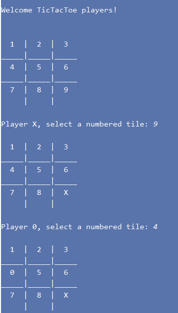

# Python Projects
     Projects for Udemy Python Bootcamp 2019-2020

## TicTacToe Game - First Python Project - Milestone 1

     Python 3.7
     IDE PyCharm Community Edition     
     
     Console Output:

 <kbd></kbd>

## Second Python Project - Milestone 2

    
